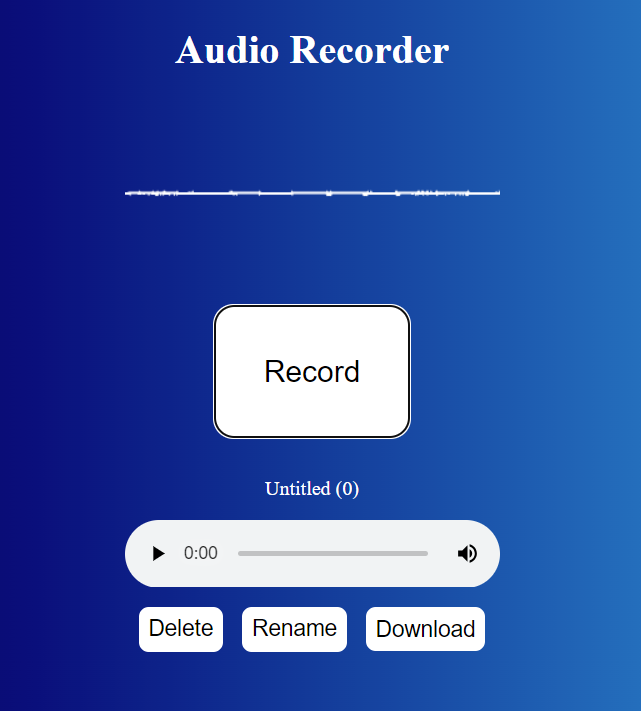

# Audio Recorder

Web-based audio recording app. A fork of [MDN's Web Dictaphone](https://github.com/mdn/dom-examples/tree/main/media/web-dictaphone).

## MDN description

A sample MDN Web Docs app that uses `getUserMedia` and the MediaRecorder API for recording audio snippets, and The Web Audio API for visualizations.
